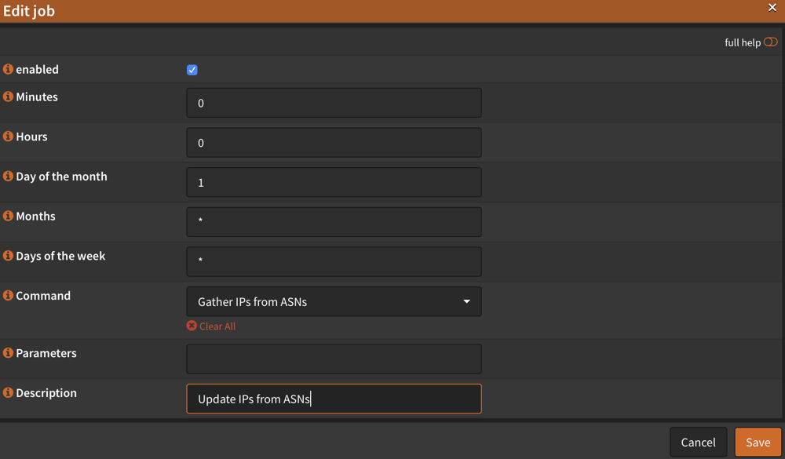

# OPNsense IP Addresses from ASN
This script creates a text file of all IPs associated with any number of ASNs for use in creating selective routing rules within OPNsense. Use it if you want to route, say, every Facebook IP address regardless of domain name to a specific firewall rule.

### Why use selective routing rules?
Some scenarios in which you may want to use this script are:

* Routing outbound traffic to specific company's ASN through a VPN
* Allowing incoming traffic from a specific company's ASN

### Limitations
This script is a hammer, not a scalpel.  It will add *ALL* IP ranges from the targeted companies to the rule.  To create rules for specific FQDNs, add them to a `Host(s)` alias in `OPNsense --> Firewalls --> Aliases` You can [read this document](https://www.arin.net/resources/guide/asn/) to learn more about ASNs.

### How it works
Gathers the IP ranges associated with the ASNs specified in the configuration file and writes these IP addresses into a text file that can be read from an OPNsense `URL Table (IPs)` alias.

# Installation and Usage
These instructions are for installing directly on a device running OPNsense.

1. SSH in to OPNsense
2. Install Git: `pkg install git`
3. Clone this repository:
   ```bash
   git clone https://github.com/natelandau/opnsense-IPs-from-ASN.git
   ```
4. Enter the directory: `cd opnsense-IPs-from-ASN`
5. Edit the configuration file (`SETTINGS.conf`) to reflect your preferences
6. Create a symbolic link to `/usr/local/bin/`
   ```bash
   sudo ln -s \
      ${HOME}/opnsense-IPs-from-ASN/ips_from_asn.sh \
      /usr/local/bin/ips_from_asn.sh
   ```
7. Enable use in OPNsense cron
   ```bash
   sudo ln -s \
      ${HOME}/opnsense-IPs-from-ASN/actions.d/ips_from_asn.conf \
      /usr/local/opnsense/service/conf/actions.d/actions_ips_from_asn.conf
    ```
8. Restart config.d: `sudo service configd restart`
9. Run the script using configd. If it works, you should see a file created at the location you specified in the settings.
   ```
   sudo configctl ips_from_asn run
   ```

## Default Configuration
The default configuration assumes you are running this script directly within OPNsense

A file named `ips_from_asn.txt` is created containing all the IP addresses.  This file is written to a directory named `custom_aliases` will is created at OPNsense's web root (`/usr/local/www`). This can be customized with the `OUTPUT_FILE` variable

Other settings should be self-evident within `SETTINGS.conf`

### Default ASNs

| Company               | ASN     |
| ---                   | ---     |
| AppNexus              | AS29990 |
| Bytedance (TikTok)    | AS396986 |
| Facebook              | AS32934 |
| Facebook Corp         | AS54115 |
| Facebook-offnet       | AS63293 |
| Google                | AS15169 |
| Oracle                | AS792   |
| Twitter               | AS35995 |

To add a new company's ASN, follow these steps.

 1. Copy an IP address from the company
 2. Paste it into this tool: https://hackertarget.com/as-ip-lookup/
 4. Add the ASN number to the `ASN_LIST` array in `SETTINGS.conf`

**NOTE:** Many companies do not have their own ASN.  If the ASN for your sample IP is a CDN (Akamai, Fastly,Cloudflare, etc), or a cloud hosting provider you will be routing ALL services hosted within that ASN.

### CLI Flags
```
 -h, --help        Display help and exit
 -n, --dryrun      Non-destructive. Makes no permanent changes.
 -q, --quiet       Quiet (no output)
 -v, --verbose     Output more information. (Items echoed to 'verbose')
 ```

 ## Configuring OPNsense
 To use this file in an OPNsense firewall rule, follow these steps

 1. Log in to your OPNsense web administration area
 2. Navigate to `Firewall --> Aliases`
 3. Click the `+` button to add a new alias
 4. Name it something
 5. Select type `URL Table (IPs)`
 6. Set it to `30 days` as a `Refresh Frequency` (These IPs don't update frequently)
 7. In the `Content` field add: `https://127.0.0.1/custom_aliases/ips_from_asn.txt`
 8. Add a `Description` if you want
 9. `Save` and `Apply` the alias
 10. Build whatever firewall rules you want

## Add the script to cron
To update these IPs, you need to add the script to cron

1. Log in to your OPNsense web administration area
2. Navigate to `System --> Administration --> Cron`
3. Click the `+` button to add a new cron task
4. Change `Day of the Month` to `1` and leave everything else as a default


